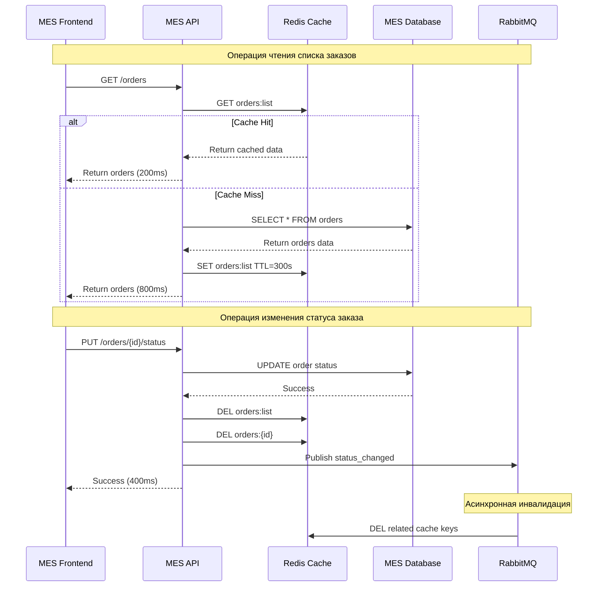
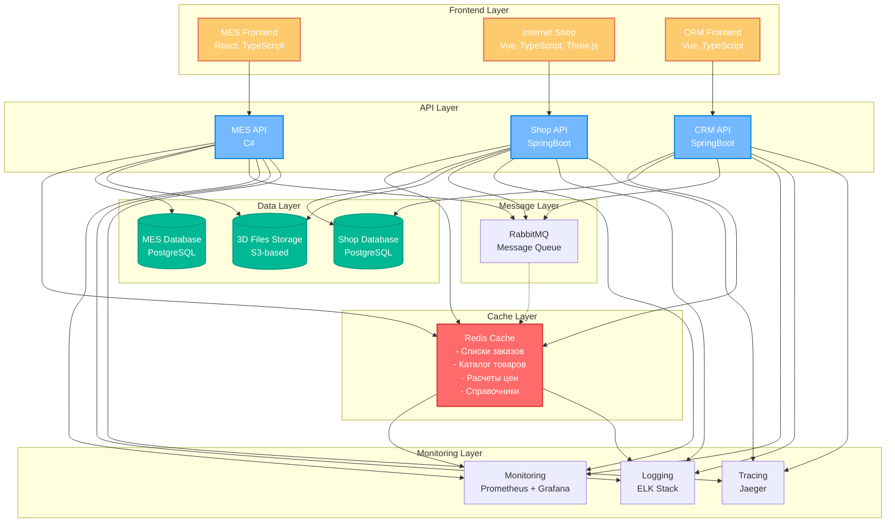
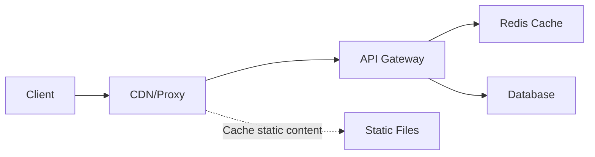
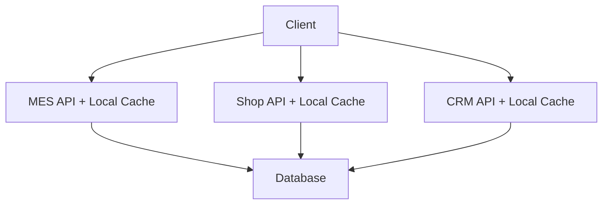

# Архитектурное решение по кешированию

## Мотивация

### Проблемы производительности

Система MES испытывает серьезные проблемы с производительностью:

1. **Низкая скорость работы MES интерфейса** - операторы жалуются на медленную загрузку списков заказов
2. **Долгий расчет цен заказов** - MES API выполняет сложные вычисления для каждого запроса
3. **Медленная работа каталога товаров** - Shop API часто обращается к базе данных для получения списка товаров
4. **Высокая нагрузка на базы данных** - PostgreSQL испытывает избыточную нагрузку от повторяющихся запросов

### Цели внедрения кеширования

1. **Сократить время отклика** - снизить время загрузки страниц MES с 3-5 секунд до 200-500 мс
2. **Уменьшить нагрузку на БД** - снизить количество запросов к PostgreSQL на 60-80%
3. **Повысить пропускную способность** - увеличить количество одновременных пользователей в 3-5 раз
4. **Улучшить пользовательский опыт** - обеспечить быструю работу интерфейсов

### Элементы системы для кеширования

- **Списки заказов** (MES API) - часто запрашиваемые данные
- **Каталог товаров** (Shop API) - относительно статичные данные
- **Расчеты цен** (MES API) - результаты сложных вычислений
- **Справочники операторов** (CRM API) - редко изменяемые данные
- **Статусы заказов** (MES API) - часто обновляемые, но читаемые данные

## Предлагаемое решение

### Выбор типа кеширования

**Серверное кеширование** с использованием Redis в качестве кеш-слоя.

**Обоснование выбора:**
- Клиентское кеширование не подходит для критически важных бизнес-данных
- Серверное кеширование обеспечивает консистентность данных между пользователями
- Redis обеспечивает высокую производительность и надежность
- Возможность реализации сложных стратегий инвалидации

### Паттерн кеширования: Cache-Aside

**Выбранный паттерн:** Cache-Aside (Lazy Loading)

**Обоснование:**
- Приложение само управляет загрузкой данных в кеш
- Простота реализации и отладки
- Высокая эффективность для read-heavy нагрузок
- Легкая настройка TTL для разных типов данных

**Почему не подходят другие паттерны:**
- **Write-Through** - избыточная сложность для системы с редкими обновлениями
- **Write-Behind** - риск потери данных при сбоях
- **Refresh-Ahead** - сложность прогнозирования паттернов доступа

### Диаграмма последовательности



### Архитектурная диаграмма с кешированием



### Стратегия инвалидации кеша

**Комбинированная стратегия инвалидации:**

1. **Временная инвалидация (TTL)** - для относительно статичных данных
2. **Инвалидация по ключу** - для данных, зависящих от конкретных сущностей
3. **Программная инвалидация** - для критически важных изменений

**Обоснование выбора:**

| Стратегия | Применение | TTL/Условие | Обоснование |
|-----------|------------|-------------|-------------|
| TTL | Списки заказов | 5 минут | Баланс между актуальностью и производительностью |
| TTL | Каталог товаров | 1 час | Редко изменяемые данные |
| TTL | Расчеты цен | 10 минут | Сложные вычисления, допустима небольшая задержка |
| По ключу | Конкретный заказ | При изменении | Мгновенная актуальность критичных данных |
| Программная | Статусы заказов | При обновлении | Критически важные изменения |

**Почему не подходят другие стратегии:**
- **Только TTL** - риск показа устаревших критичных данных
- **Только по событиям** - сложность реализации и отладки
- **Только программная** - избыточная нагрузка на приложение

### Сравнительная таблица стратегий инвалидации

| Стратегия | Плюсы | Минусы | Применимость |
|-----------|-------|--------|--------------|
| **Временная (TTL)** | Простота реализации<br>Автоматическая очистка<br>Низкая нагрузка на приложение | Возможны устаревшие данные<br>Фиксированное время жизни | Статичные данные<br>Каталоги товаров |
| **По ключу** | Мгновенная актуальность<br>Точный контроль<br>Эффективное использование памяти | Сложность управления<br>Риск "дыр" в кеше | Критичные данные<br>Заказы, статусы |
| **Программная** | Полный контроль<br>Мгновенная реакция<br>Гибкость логики | Высокая сложность<br>Риск ошибок<br>Нагрузка на приложение | Критичные изменения<br>Финансовые данные |
| **По событиям** | Автоматическая реакция<br>Масштабируемость<br>Слабая связанность | Сложность настройки<br>Зависимость от инфраструктуры<br>Задержки | Микросервисная архитектура<br>Высоконагруженные системы |

### Рекомендуемая конфигурация Redis

```yaml
# Redis Configuration
maxmemory: 2gb
maxmemory-policy: allkeys-lru
timeout: 300
tcp-keepalive: 60

# Кеш-ключи и TTL
cache_keys:
  orders:list: "300s"           # Список заказов
  orders:{id}: "600s"           # Конкретный заказ
  products:catalog: "3600s"     # Каталог товаров
  operators:list: "1800s"       # Список операторов
  price:calculation:{hash}: "600s" # Расчеты цен
```

### Ожидаемые результаты

1. **Производительность:**
   - Время отклика MES: с 3-5 сек до 200-500 мс
   - Нагрузка на БД: снижение на 70%
   - Пропускная способность: увеличение в 4 раза

2. **Надежность:**
   - Graceful degradation при недоступности кеша
   - Автоматическое восстановление соединений
   - Мониторинг hit/miss ratio

3. **Масштабируемость:**
   - Горизонтальное масштабирование Redis
   - Возможность добавления новых типов кеширования
   - Интеграция с существующей инфраструктурой мониторинга

## Дополнительные варианты решений

### Вариант 1: Гибридное кеширование (Рекомендуемый)

**Описание решения:**
Комбинация Redis для серверного кеширования и HTTP-кеширования на уровне CDN/прокси для статических ресурсов.

**Диаграмма:**


**Плюсы:**
- Максимальная производительность
- Снижение нагрузки на серверы
- Глобальное распределение контента
- Кеширование на разных уровнях

**Минусы:**
- Сложность настройки
- Дополнительные затраты на CDN
- Управление несколькими кеш-слоями

### Вариант 2: In-Memory кеширование в приложении

**Описание решения:**
Использование встроенного кеша в каждом API-сервисе (например, Caffeine для Java, MemoryCache для C#).

**Диаграмма:**


**Плюсы:**
- Простота реализации
- Нет дополнительной инфраструктуры
- Минимальная задержка
- Автономность сервисов

**Минусы:**
- Дублирование данных между сервисами
- Ограниченная память на сервере
- Сложность синхронизации
- Неэффективное использование ресурсов

### Сравнительная таблица решений

| Критерий | Гибридное кеширование | In-Memory кеширование | Только Redis |
|----------|----------------------|----------------------|--------------|
| **Производительность** | ⭐⭐⭐⭐⭐ | ⭐⭐⭐⭐ | ⭐⭐⭐⭐ |
| **Сложность реализации** | ⭐⭐ | ⭐⭐⭐⭐ | ⭐⭐⭐ |
| **Стоимость** | ⭐⭐ | ⭐⭐⭐⭐⭐ | ⭐⭐⭐ |
| **Масштабируемость** | ⭐⭐⭐⭐⭐ | ⭐⭐ | ⭐⭐⭐⭐ |
| **Надежность** | ⭐⭐⭐⭐ | ⭐⭐⭐ | ⭐⭐⭐⭐ |
| **Управляемость** | ⭐⭐ | ⭐⭐⭐ | ⭐⭐⭐⭐ |

### Рекомендация

**Выбранное решение: Только Redis** - оптимальный баланс между производительностью, сложностью и стоимостью для текущих потребностей системы.

**Обоснование:**
- Достаточная производительность для решения текущих проблем
- Простота внедрения и поддержки
- Интеграция с существующей инфраструктурой
- Возможность миграции на гибридное решение в будущем
